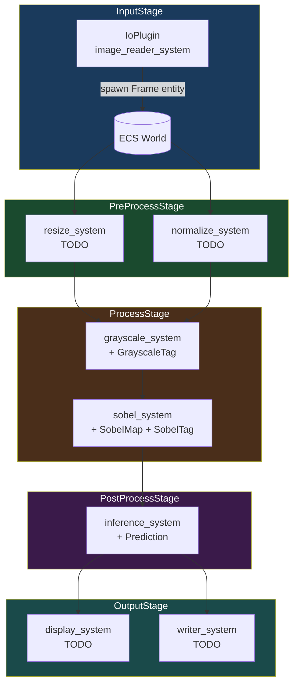
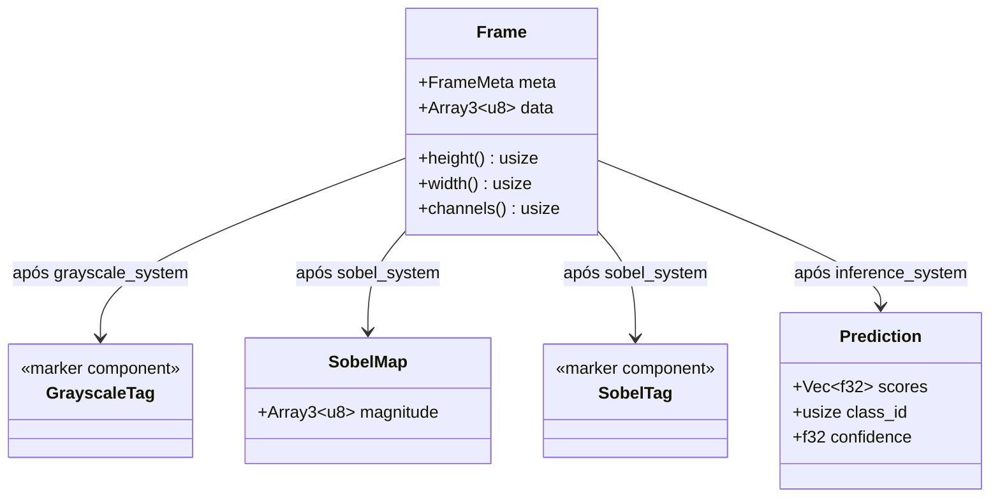
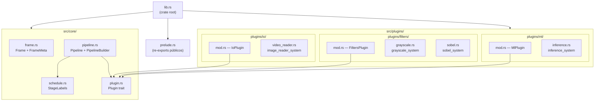
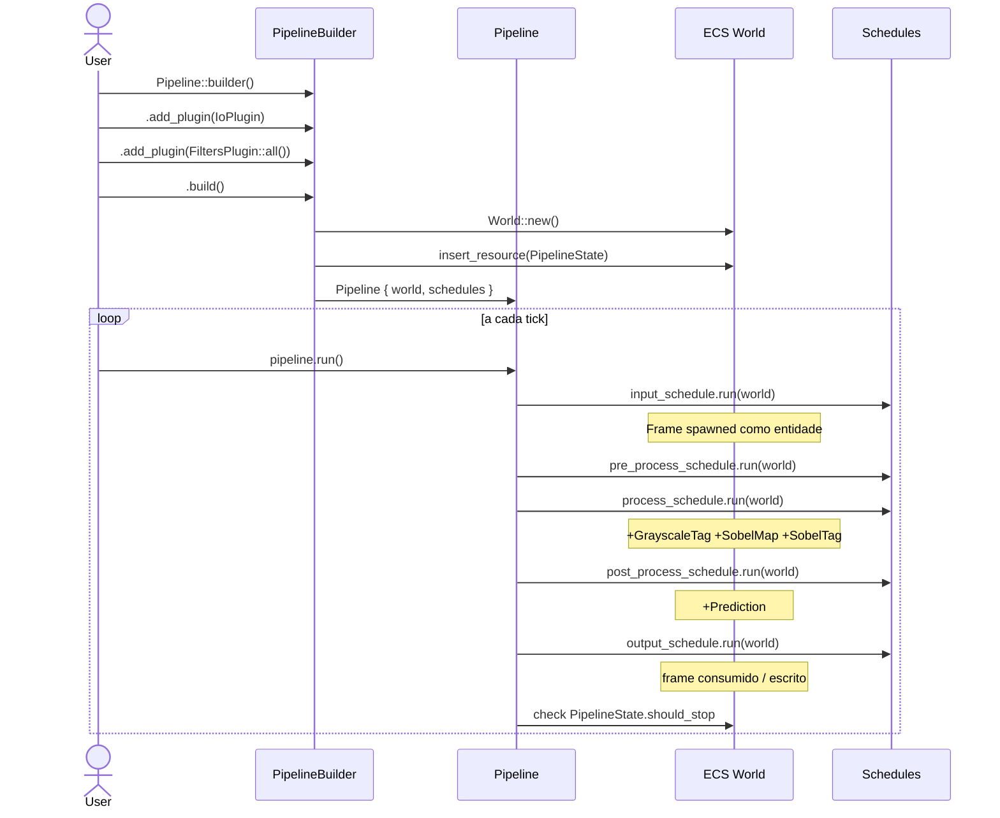

# Perceptor — Architecture

## Vision

Perceptor é uma biblioteca de Computer Vision onde **frames de vídeo são Entidades** em um mundo ECS (Entity Component System). Transformações de imagem são **Sistemas** que leem e escrevem **Componentes** nessas entidades. Essa abordagem oferece:

- **Composabilidade**: filtros são independentes e combináveis sem herança
- **Testabilidade**: sistemas são funções puras testáveis isoladamente
- **Paralelismo implícito**: o scheduler do ECS paralleliza sistemas sem conflito de acesso
- **Extensibilidade**: novos filtros/backends são plugins, sem tocar no core

---

## Fluxo de um frame (pipeline completo)

---

## Modelo ECS aplicado a CV

---

## Estrutura de Módulos

---

## Ciclo de vida do Pipeline

---

## Camadas da Arquitetura

| Camada        | Módulo           | Responsabilidade                              |
|---------------|------------------|-----------------------------------------------|
| **Core/ECS**  | `core/`          | World, Schedule, Frame entity, Plugin trait   |
| **I/O**       | `plugins/io/`    | Leitura de fontes, escrita de saídas          |
| **Filtros**   | `plugins/filters/` | Transformações clássicas (grayscale, Sobel) |
| **ML**        | `plugins/ml/`    | Inferência com ONNX/PyTorch                   |
| **GPU**       | *(futuro)*       | Compute shaders via `wgpu`                    |

---

## Decisões de Design

### Por que `bevy_ecs` e não um ECS próprio?
- ECS maduro, battle-tested, com scheduler paralelo embutido
- Sistema de plugins idêntico ao Bevy — reaproveitamos o padrão
- Separável do Bevy completo (`bevy_ecs` como dependência standalone)

### Por que `ndarray` e não `Vec<u8>` plano?
- Semântica dimensional explícita `[H, W, C]` — erros de shape em compile-time (com `ndarray`)
- Integração nativa com `rayon` via feature `rayon` do ndarray
- Conversão direta para tensores `tch-rs`/`ort` sem cópia

### Por que stages separados (Input/Process/Output) e não um schedule único?
- Garante ordem de dependência entre sistemas sem necessidade de `.after()`/`.before()` manual
- Facilita profiling por fase
- Permite futures stages assíncronos (ex: input assíncrono de câmera)
