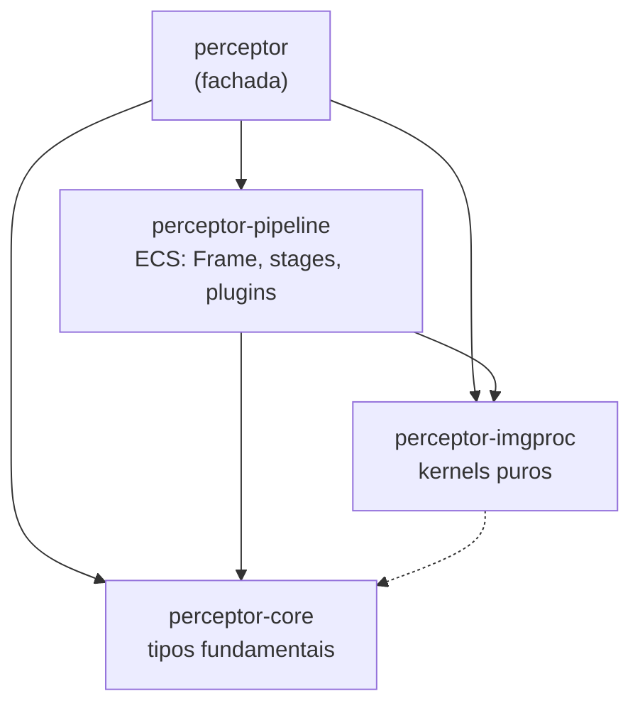
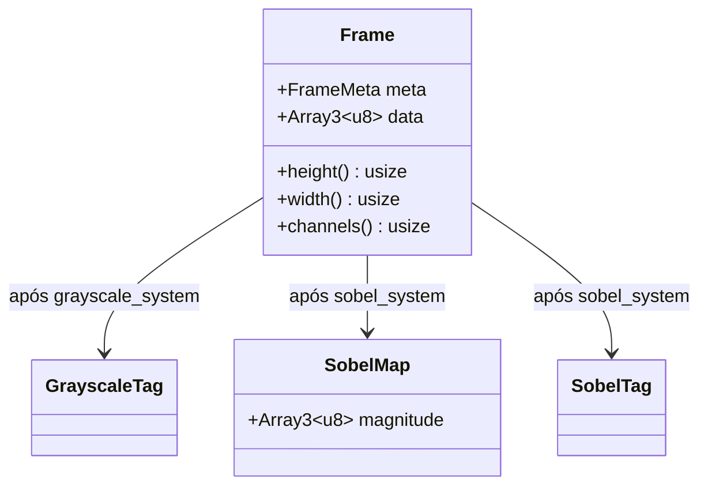

# Arquitetura

## Camadas

O workspace é dividido em crates com dependências em uma única direção:



| Crate | Responsabilidade | Depende de ECS? |
|---|---|---|
| `perceptor-core` | tipos fundamentais (imagem, pixel, erro) — em construção no milestone M1 | não |
| `perceptor-imgproc` | algoritmos como funções puras | não |
| `perceptor-pipeline` | `Frame`, stages, plugins e sistemas que chamam os kernels | sim |
| `perceptor` | fachada que reexporta as camadas e o `prelude` | — |

Crates planejadas (`perceptor-io`, `perceptor-hw`, `perceptor-ml`, `perceptor-gpu`, `perceptor-recipes`) estão descritas no [roadmap](../projeto/roadmap.md).

## Por que separar kernels do ECS

Um kernel que não conhece o `World` pode ser:

- **testado** com uma imagem sintética e um `assert`;
- **medido** em um benchmark sem montar um pipeline;
- **otimizado** (SIMD, paralelismo, GPU) mantendo a versão escalar como referência de corretude.

O sistema ECS correspondente fica reduzido a: consultar frames, chamar o kernel e anexar o resultado.

```rust
// perceptor-imgproc: função pura
pub fn convert_to_gray(input: &Array3<u8>) -> Array3<u8> { /* ... */ }

// perceptor-pipeline: sistema que a orquestra
pub fn grayscale_system(
    mut query: Query<(Entity, &mut Frame), Without<GrayscaleTag>>,
    mut commands: Commands,
) {
    for (entity, mut frame) in &mut query {
        frame.data = convert_to_gray(&frame.data);
        commands.entity(entity).insert(GrayscaleTag);
    }
}
```

## Modelo de dados



Hoje `Frame` guarda um tensor `ndarray` no formato `[altura, largura, canais]` com valores `u8`. No milestone M1 ele passa a usar o tipo de imagem próprio de `perceptor-core`, com formato de pixel no tipo e layout controlado.

## Decisões

| Decisão | Motivo |
|---|---|
| `bevy_ecs` como motor | ECS maduro com scheduler paralelo, utilizável sem o restante do Bevy |
| Stages fixos | ordem de dependência previsível entre leitura, processamento e saída |
| `unsafe` confinado | restrito a módulos isolados (SIMD, hardware); `perceptor-core` usa `forbid(unsafe_code)` |
| Referência escalar | toda otimização é validada contra a implementação simples |
