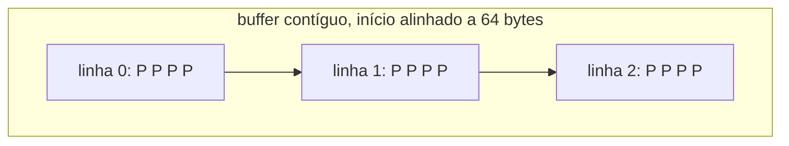
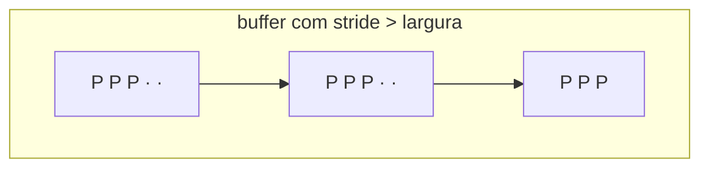

# Modelo de imagem

## Formato no tipo

Uma imagem é `Image<P>`, onde `P` é o formato de pixel (`L8`, `Rgb8`, `RgbF32`...). Um kernel declara o que aceita na assinatura:

```rust
fn to_gray(src: &Image<Rgb8>, dst: &mut Image<L8>) { /* ... */ }
```

Passar uma imagem em tons de cinza para essa função é erro de compilação, não uma checagem de canais em runtime.

## Layout de memória



- Pixels em **ordem de linha**, canais **intercalados** (`R G B R G B ...`).
- O início do buffer é múltiplo de **64 bytes**: uma linha de cache, e o maior alinhamento que instruções SIMD exigem.
- Cada formato de pixel tem exatamente o layout de um array de subpixels, então a mesma memória pode ser vista como `&[Rgb8]`, `&[u8]` (subpixels) ou bytes, sem cópia.

## Dona do buffer × visão

| Tipo | Dono da memória | Linhas com preenchimento | Uso |
|---|---|---|---|
| `Image<P>` | sim, alinhada a 64 bytes | não | resultado de kernels, armazenamento |
| `ImageView<'a, P>` | não | sim | entrada de kernels, recortes, buffers de câmera |
| `ImageViewMut<'a, P>` | não, acesso exclusivo | sim | saída de kernels, recortes, faixas paralelas |

Kernels recebem visões, não imagens: assim a mesma função opera sobre a imagem inteira, sobre um recorte ou diretamente sobre o buffer mapeado de uma câmera.



O **stride** é a distância entre o início de duas linhas, em subpixels. O que sobra depois dos pixels de cada linha é preenchimento, que as visões nunca leem nem escrevem. A última linha não precisa dele.

## Como o alinhamento é garantido sem `unsafe`

`Vec<u8>` só garante alinhamento 1. Em vez de chamar o alocador diretamente, `Image` guarda um `Vec` de blocos declarados com `#[repr(C, align(64))]`: o alocador é obrigado a alinhar o vetor a 64. Esse vetor é então reinterpretado como bytes e como pixels pela crate `bytemuck`, que verifica tamanho e alinhamento. O custo é desperdiçar no máximo 63 bytes no último bloco.

## Invariantes

| Invariante | Como é mantida |
|---|---|
| `width > 0` e `height > 0` | construtores retornam `InvalidDimensions` |
| `width · height · size_of::<P>()` cabe em `isize` | multiplicação checada na construção |
| falta de memória não derruba o processo | reserva falível (`try_reserve_exact`) → `Allocation` |
| `(x, y)` nunca cai na linha seguinte | `get` checa `x < width` separadamente de `y` |
| toda linha de uma visão cabe no buffer | geometria validada em `ImageView::new` e em cada `roi` |
| metades de `split_at_row` não se sobrepõem | `split_at_mut` do buffer; verificado pelo compilador |

Detalhes da API em [perceptor-core](../referencia/perceptor-core.mdx).
