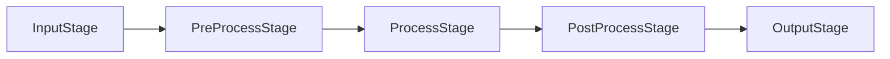

# Pipeline e stages

## Ciclo de um tick

`Pipeline::tick()` executa cinco stages, sempre nesta ordem:



| Stage | Uso |
|---|---|
| `InputStage` | fontes criam entidades `Frame` |
| `PreProcessStage` | preparação (resize, normalização) |
| `ProcessStage` | filtros e detecção |
| `PostProcessStage` | agregação de resultados (NMS, tracking) |
| `OutputStage` | escrita em disco, exibição |

`Pipeline::run()` repete ticks até `PipelineState::should_stop` ser `true`.

## Controle de parada

```rust
use perceptor::prelude::*;

let mut pipeline = Pipeline::builder().with_max_ticks(3).build();
pipeline.run()?; // executa exatamente 3 ticks
```

`PipelineState` é um recurso ECS com dois campos:

| Campo | Significado |
|---|---|
| `tick_count` | ticks já executados |
| `should_stop` | qualquer sistema pode defini-lo para encerrar o loop |

## Visibilidade de componentes

Componentes inseridos via `Commands` só são aplicados ao final do stage em que o sistema rodou. Consequências:

- um componente inserido no `ProcessStage` já é visível no `PostProcessStage` do **mesmo** tick;
- dois sistemas no **mesmo** stage não veem as inserções um do outro até o tick seguinte.

Por isso, com `FiltersPlugin::all()`, o `grayscale_system` marca o frame no tick 1 e o `sobel_system` — que exige `GrayscaleTag` e está no mesmo stage — só o processa no tick 2.

:::note
Essa limitação é resolvida no milestone M2, que substitui os cinco schedules por um único schedule com ordenação explícita entre sistemas ([#39](https://github.com/Bappoz/perceptor/issues/39)).
:::

## Tratamento de erros

Kernels e funções de I/O retornam [`perceptor_core::Result`](../referencia/perceptor-core.mdx). Dentro do pipeline, porém, os sistemas ainda registram a falha em log (`tracing`) e seguem ou sinalizam parada; `tick()` não retorna erro. A propagação de erros com política configurável está planejada em [#40](https://github.com/Bappoz/perceptor/issues/40).
